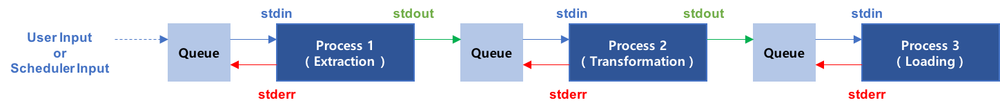

# Event Flow 개요 

## Event Flow 란?
Event Flow는 표준입출력( Standard In / Out / Error )을 이용하여 다수의 프로세스를 연결시켜 주는 ETL 플랫폼이다.

## ETL 이란?
ETL은 데이터의 추출( Extraction )-변환( Transformation )-적재( Loading ) 의 약자로 비지니스 인텔리전스( Business Intelligence ) 구현을 위한 기본 구성요소 가운데 하나다. ETL 툴은 다양한 원천 데이터를 취합해 데이터를 추출하고 하나의 공통된 포맷으로 변환해 데이터 웨어하수나 데이터 마트 등에 적재하는 과정을 지원하는 툴을 의미한다.

## Event Flow의 기본 동작 원리
Event Flow는 기본적으로 아래와 같이 동작한다.



위의 그림은 ETL이 Event Flow에서 동작하는 원리에 대한 그림이다. 위의 ETL 같은 경우 표준적인 형태로 하나의 추출, 하나의 변환, 하나의 적재로 구성되어 있다.
각각의 프로세스는 사용자가 구현하여야 하며 각각의 프로세스는 표준입출력을 이용하여 통신한다.

먼저 가장 첫번째 프로세스, Process01은 사용자 명령 혹은 스케쥴러에 의해 신호를 받는다. 이 신호는 Queue에 저장되었다가 Process01의 StdIn 으로 전달된다. Process01은 StdIn으로부터 해당 신호를 읽어서 해당 신호에 맞는 작업을 수행한 뒤, Process02로 신호를 전닲하기 위해서 StdOut으로 신호를 보낸다. 이후 Process01은 StdIn으로 받은 작업이 끝났다는 것을 Queue에 알려주고 다음 신호를 받기 위해서 StdErr로 Queue에 신호를 보낸다. 이 때 StdErr는 받은 StdIn과 동일한 신호를 보낸다.
이렇게 한 번의 신호가 오가고 나면 Process01은 다음 작업을 위해 대기하게 되고, Process02는 Process01과 동일한 동작을 수행하게 된다.

## 용어정리

### Task ( 테스크 )
하나의 프로세스를 의미하는 용어로 해당 프로세서는 ETL의 어떤 것도 될 수 있다. 하나의 프로세스에서 하나 이상의 작업을 수행할 수 있다.

### Flow ( 플로우 )
Task, 즉 하나의 프로세스와 프로세스를 연결하는 흐름을 의미한다. Flow는 1:1, 1:n, n:1, n:n 형태를 모두 지원하며 아래의 두 가지 타입을 가진다.

#### Broad Flow ( 브로드 플로우 )
Broad Flow는 플로우의 한 종류로 앞에 위치한 Task에서 나오는 Standard Out을 모든 뒤에 위치한 Task에 전달한다.
```
ex) BroadFlow, process01 -> process02, process03 이라고 할 때 
    Standard Out이 "output" 이라고 한다면,
    process02 는 "output"을 Standard In으로 받는다.
    process03 은 "output"을 Standard In으로 받는다.
```

#### Shared Flow ( 쉐어드 플로우 )
Shared Flow는 플로우의 한 종류로 앞에 위치한 Task에서 나오는 Standard Out을 나누어 가진다.
```
ex) SharedFlow, process01 -> process02, process03 이라고 할 때 
    Standard Out이 "output" 이라고 한다면,
    process02 는 "output"을 Standard In으로 받는다.
    process03 은 다음 Standard Out을 기다린다.
```

### Job ( 잡 )
다수의 Task와 다수의 Flow로 이루어진 하나의 ETL을 의미한다. 해당 Job에는 플로우가 없을 수도 있다.

